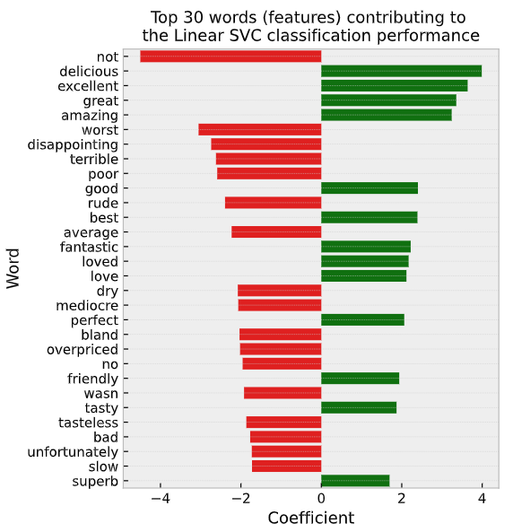

# Sentiment-Classification-for-Restaurant-Reviews

In this project, a sentiment classification system was implemented to classify restaurants reviews as positive/negative in a supervised learning setting.

The data used in thisproject was annotated by 2 different annotators, present in the data in the annotation column as (annotator1/annotator2). Therefore, we calculated the percentage of disagreement between the annotators, and investigated the rows that had disagreements. Furthermore, we trained and cross-validated several models, and hyper-parameter tuned the best performing models.

Moreover, to evaluate the best performing model on the testing set, we used a confusion matrix along with Precision/Recall curves.

Finally, we investigated the features (words) highest contributing to the model preddictive power for model interpretability (presented in the figure below).

  

